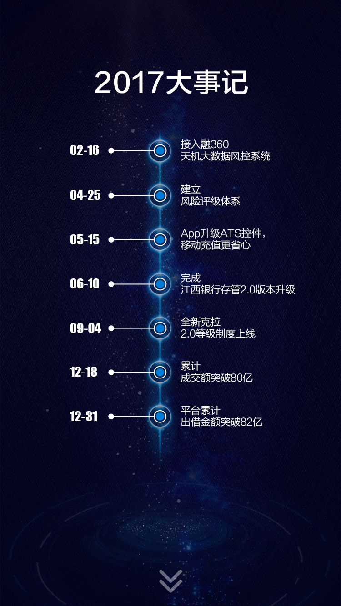
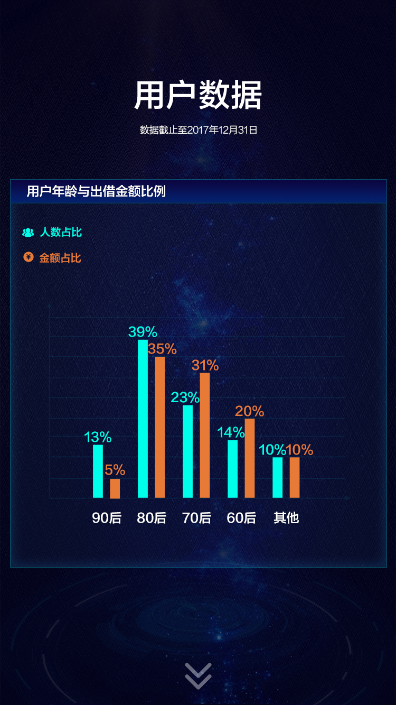
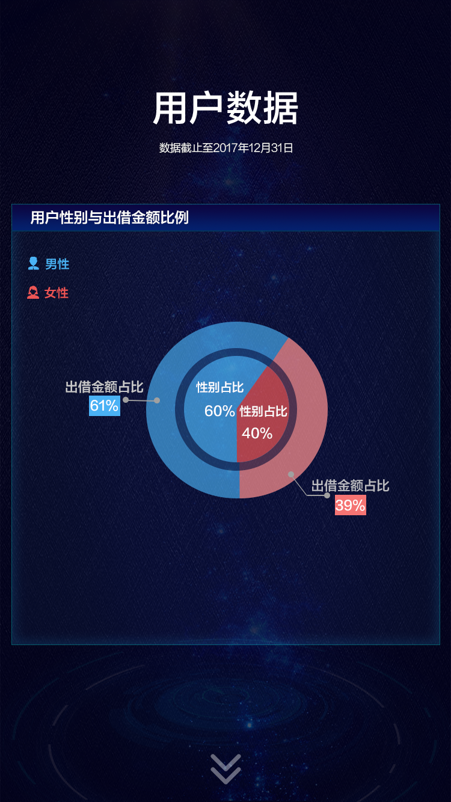

## User Interface

<a href="#" target="_blank"></a>
<a href="#" target="_blank"></a>
<a href="#" target="_blank"></a>
<a href="#" target="_blank"></a>

## Quick start

Several quick start options are available:

- Install dependencies with [npm](https://www.npmjs.com/): `npm install`
- App development Run `npm run appdev`
- Build Run `bash build.sh @param1 @param2` (@param1:`app`; @param2:`--no-minify`)
- Open `http://localhost:1234` in your browser.

## What's included

```
new_year_market/
├── src/
│   ├── assets/
│   │   ├── normalize/
│   │   │   └── index.scss    //统一浏览器默认样式
│   │   ├── iconfonts/
│   │   │   └── index.scss    //内联字体&&字体图标
│   │   ├── animation/
│   │   │   └── index.scss    //css动画
│   │   ├── mixins/
│   │   │   └── index.scss    //可重用的代码块@mixin
│   │   └── app.scss    //开发样式入口
│   └── app/
│       ├── index.html    //开发页
│       ├── index.js    //开发脚本
│       └──template.tpl    //上线模板
├── clearcache.sh    //清除缓冲
├── autocopy.py    //自动拷贝上线代码
├── build.sh    //打包
└── .browserslistrc    //支持的浏览器
```
