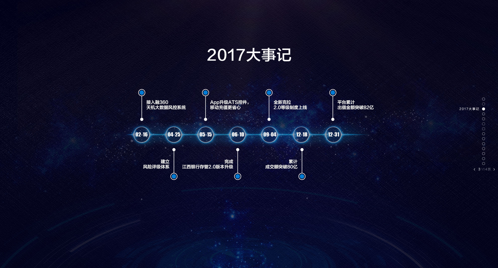
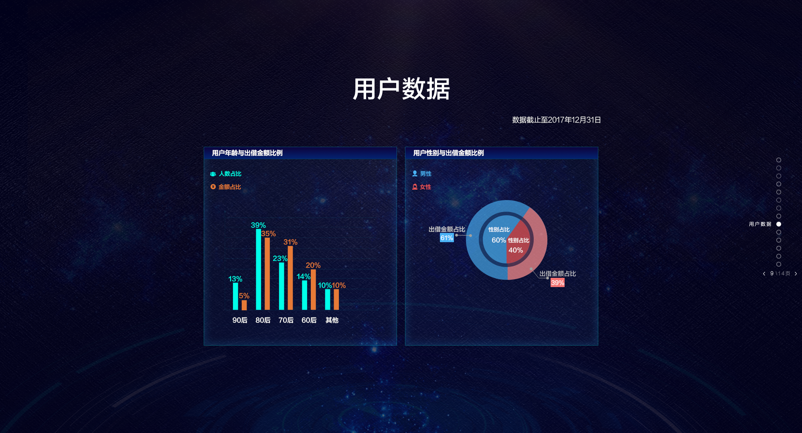

## Quick start

Several quick start options are available:

- Install dependencies with [npm](https://www.npmjs.com/): `npm install`
- App development Run `npm run webdev`
- Build Run `bash build.sh @param1 @param2` (@param1:`web`; @param2:`--no-minify`)
- Open `http://localhost:1234` in your browser.

## Link

- [click here](https://www.yindou.com/events/report_2017)

## User Interface

