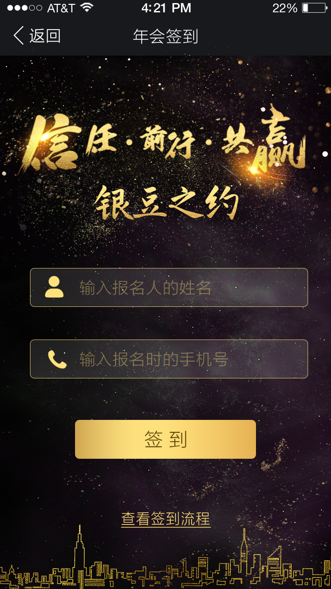

## User Interface

## Quick start

Several quick start options are available:

- Install dependencies with [npm](https://www.npmjs.com/): `npm install`
- App development Run `npm run dev`
- Open `http://localhost:1234` in your browser.
